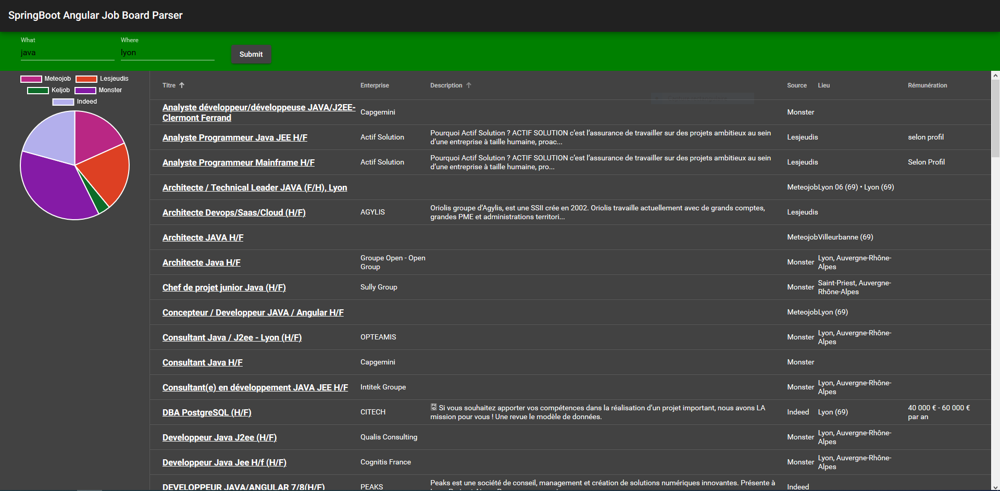

# Springboot_angular-job_parser

Springboot_angular-job_parser is an application whose purpose is to aggregate several job boards into an easy one. Splited into  2 parts with a backend and a frontend, it uses Angular and java SpringBoot.

```
                     +-----------+              +-----------+
                     | FrontEnd  |              |  BackEnd  |
                     |-----------|              |-----------|
                     |           |              |Java 8     |
                     |Angular 8.2|    REST      |           |
                     |           |------------->|SpringBoot |
                     |           |              |   2.3     |
                     |           |              |           |
                     |           |              |Maven 3.6.2|
                     |           |              |           |
                     +-----------+              +-----------+
```



## Road to v1

- [x] responsive
- [ ] reactive
- [ ] tag cloud
- [ ] merge build
- [ ] Dockerize
- [x] SSR
- [ ] Sitemap
- [ ] Routing
- [ ] images for job boards 
- [ ] home page with photo
- [ ] gps city
- [ ] slogan


## Frontend

```
cd frontend
ng serve --host 0.0.0.0 --prod
```


## Backend

```
java -jar job.parser-0.0.1-SNAPSHOT.jar &
```


## Build frontend for production

```
ng build --prod
```


## Build backend for production

```
#BEFORE: Copy angular frontend build to backend
#TODO: Bring angular compilation into maven build process
cp frontend/dist/Angular-Job-Parser/* backend/src/main/resources/static 
mvn clean install
```


## Build & Run SSR version

```
npm run build:ssr && npm run serve:ssr
```

